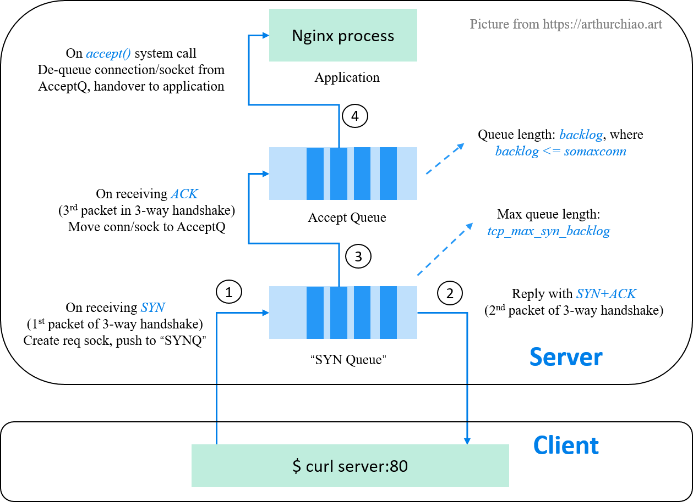

TCP Socket Listen: A Tale of Two Queues (2022)

Published at 2022-08-28

https://arthurchiao.art/blog/tcp-listen-a-tale-of-two-queues/

On encountering problems related to TCP listen overflow, listen drop etc, almost all search results on the internet will tell you that there are two queues for each listening socket:

A SYN queue: used for storing connection requests (one connection request per SYN packet);
An accept queue: used to store fully established (but haven’t been accept()-ed by the server application) connections

