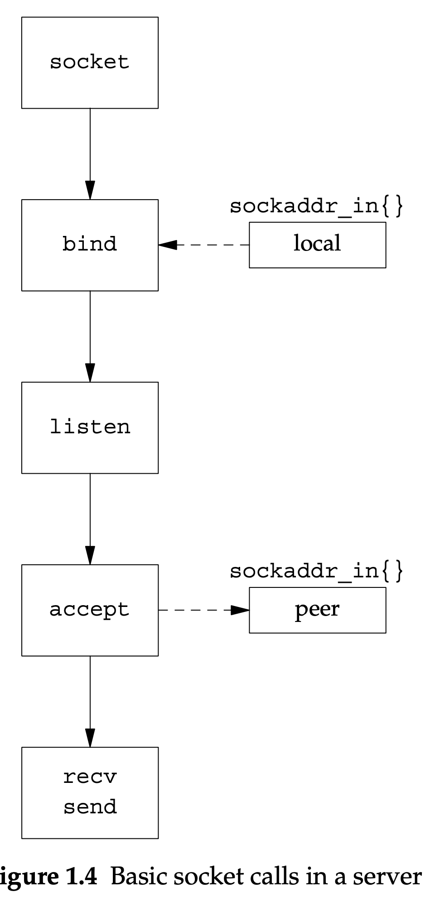

int connect( SOCKET s, const struct sockaddr *peer, int peer_len );

The s parameter is the socket descriptor returned by the socket call. The peer parame- ter points to an address structure that holds the address of the desired peer and some other information. For the AF_INET domain, this is a sockaddr_in structure. We look at a simple example in a moment. The peer_len parameter is the size of the struc- ture pointed to by peer.
Once we’ve set up a connection, we are ready to transfer data. Under UNIX we can simply call read and write using the socket descriptor exactly as we would a file descriptor. 

Effective TCP_IP programming-(2000) - Basic Sockets API Review

A server must listen for client connections on its well-known port. As we see in a moment, it does this with the listen call, but first it must bind the address of the inter- face and well-known port to its listening socket. This is done with the bind call

Basic socket calls in a server



A server must listen for client connections on its well-known port. As we see in a moment, it does this with the listen call, but first it must bind the address of the inter- face and well-known port to its listening socket.

the listen system call: This call is often misunder- stood. Its only job is to mark the socket as listening. When a connection request arrives at the host, the kernel searches the list of listening sockets looking for one that matches the destination and port number in the request

int listen( SOCKET s, int backlog );

The backlog parameter: is the maximum number of pending connections that can be out- standing. This is not the maximum number of connections that can be established at the given port at one time. It is the maximum number of connections or partial connections that can be queued waiting for the application to accept them
we must check the system documentation to find the proper value for a given machine.

SOCKET accept( SOCKET s, struct sockaddr *addr, int *addrlen );

accept returns the address of the new connection’s peer in the sockaddr_in struc- ture pointed to by addr. 

Fill In Address and Get a Socket
We fill in the sockaddr_in structure, local, with our server’s well-known address and port number. We use this for the bind call. As with the client, we obtain a SOCK_STREAM socket. This is our listening socket.
Bind Our Well-Known Port and Call listen
We bind the well-known port and address specified in local to our listening
socket. We then call listen to mark the socket as a listening socket. Accept a Connection
We call accept to accept new connections. The accept call blocks until a new connection is ready and then returns a new socket for that connection.
Transfer Data
We first read and print 1 byte from our client. Next, we send the single byte 2 back to our client and exit.

Address already in use
----------------------

One of the most frequently asked questions in the networking news groups is: 
‘‘If my server crashes or is terminated, and I try to restart it, I get the error ‘Address already in use.’ 
After a few minutes, I am able to restart the server. How can I cause my server to restart immediately?’’

TCP is not allowing our server to restart because the previous connection is still in the TIME-WAIT state.

We can instruct TCP to allow us to bind a port that is already in use by first setting the SO_REUSEADDR socket option.

```
// Create a socket
    sockfd = socket(AF_INET, SOCK_STREAM, 0);
    if (sockfd < 0) {
        perror("Socket creation failed");
        return 1;
    }

    // Set the SO_REUSEADDR option
    if (setsockopt(sockfd, SOL_SOCKET, SO_REUSEADDR, &reuse, sizeof(reuse)) < 0) {
        perror("Setting SO_REUSEADDR failed");
        return 1;
    }
```
it is important that we make the setsockopt call before the call to bind.


How to Time Out a connect Call
------------------------------

the normal TCP connection establishment procedure involves the exchange of three segments (called the three-way handshake).

the procedure is initiated by a connect call from the client, and ends when the server receives the ACK

In the normal case of a blocking socket, connect does not return until the ACK from the client’s SYN arrives. 

There are two methods for timing out a connect call. The easiest way is simply to set an alarm around the call.

The second, more general, method of timing out a connect call is to make the socket nonblocking and then wait for it to complete with select.

```
In the context of network programming, setting a socket to non-blocking mode allows for asynchronous I/O operations. When a socket is in non-blocking mode, certain operations, such as reading or writing data, will not block the execution of the program. Instead, they return immediately, even if there is no data available or the socket's buffers are full.

Here's a breakdown of the line of code you provided:

fcntl(s, F_SETFL, flags | O_NONBLOCK): The fcntl() function is called to modify the file descriptor s using the F_SETFL command, which sets the file status flags.
The flags | O_NONBLOCK expression combines the existing flags with the O_NONBLOCK flag using the bitwise OR operator (|), effectively adding the O_NONBLOCK flag to the existing flags.

O_NONBLOCK: This is a flag that indicates non-blocking mode. When this flag is set, the socket will operate in non-blocking mode, allowing for asynchronous I/O operations.

By adding the O_NONBLOCK flag to the existing flags using the fcntl() function, you are enabling non-blocking mode for the socket s. This means that subsequent I/O operations on the socket, such as reading or writing data, will not block and will return immediately, allowing your program to continue execution even if the operation cannot be completed immediately.

Setting a socket to non-blocking mode is often useful in scenarios where you want to perform multiple I/O operations concurrently or handle I/O operations without blocking the execution of other parts of your program.

--

Let's assume flags is currently set to 00101011 in binary representation, and the O_NONBLOCK flag is defined as 00000100.


00101011   (flags)
| 00000100   (O_NONBLOCK)
-----------
  00101111

his means the O_NONBLOCK flag has been added to the existing flags.
```


====

The socket is an abstract object from which messages are sent and received, much like a file is an abstract object on which file data is read and written. 

