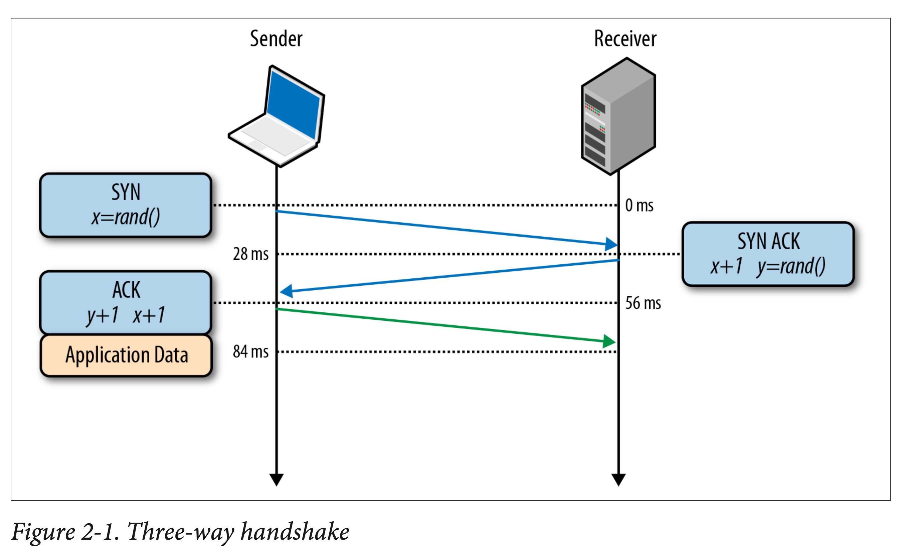

the important elements in the TCP handshake process:

1. Source and Destination IP Addresses
2. Source and Destination Port Numbers
3. SYN (Synchronize) Flag
4. SYN-ACK (Synchronize-Acknowledge) Flag
5. Initial Sequence Numbers (ISN)
6. Window Size
7. Maximum Segment Size (MSS)
8. TCP Options
9. Urgent Pointer
10. Acknowledgment Number
11. TCP Flags
12. TCP Sequence Numbers
13. Connection Establishment
14. TCP Window Scaling
15. Selective Acknowledgment (SACK)
16. Timestamps
17. Retransmission Timeout
18. Connection Termination
19. Congestion Control

These points outline the key elements involved in the TCP handshake process.

low-level details of the TCP handshake process:

*****

SYN cookies are a technique used to mitigate SYN flood attacks by allowing a server to handle connection requests without maintaining a SYN queue.

Here's a high-level overview of how SYN cookies are implemented:

1. Initial SYN Packet Reception: When a server receives an initial SYN packet from a client, instead of allocating server resources and storing the connection details in a SYN queue, it generates a SYN cookie.

2. SYN Cookie Generation: The server creates a unique SYN cookie by encrypting a combination of the source IP address, source port, a secret key, and additional information. The encryption process typically involves cryptographic hash functions.

3. SYN Cookie Transmission: The server sends the SYN-ACK packet back to the client, containing the SYN cookie instead of storing connection details in a SYN queue. The SYN cookie is designed to be self-contained and carry the necessary information to validate the connection request.

4. SYN Cookie Validation: When the client receives the SYN-ACK packet, it extracts the SYN cookie and sends an ACK packet back to the server. The client's ACK packet includes the original SYN packet's sequence number, allowing the server to validate the connection request.

5. Connection Establishment: The server verifies the received ACK packet by regenerating the SYN cookie using the same algorithm. If the regenerated SYN cookie matches the one received from the client, the server establishes the connection and proceeds with the TCP handshake.

By using SYN cookies, the server avoids the need for a SYN queue and eliminates the risk of SYN flood attacks overwhelming system resources. SYN cookies allow the server to defer connection state storage until after the client's legitimacy is verified during the handshake process.

It's worth noting that the specific implementation details of SYN cookies may vary depending on the operating system and TCP/IP stack used.
