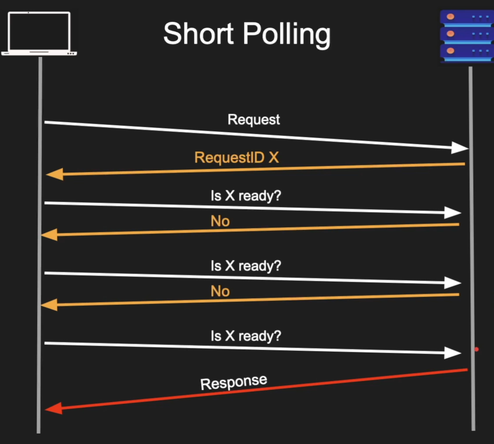

intro : https://nima101.github.io/io_multiplexing

kqueue : https://nima101.github.io/kqueue_server

Using metaphors to describe the mechanisms, we can liken select, poll and epoll to different types of individuals:

These metaphors provide imaginative ways to understand the mechanisms at a high level.

1. `poll`: In a metaphorical sense, `poll` can be represented by a persistent and vigilant security guard stationed at a gate. This guard continuously asks each person passing by, "Are you ready to enter? Are you ready to enter?" until someone finally provides the necessary authorization or permission to pass through.

2. `epoll`: can be metaphorically represented by a wise grandpa who takes a nap but instructs his family members, "Here are the specific things that you should wake me up for. When any of those things happen, please notify me immediately." The grandpa trusts his family to handle the day-to-day activities, but he wants to be alerted promptly if something important occurs.

3. `select`: In a metaphoric sense, `select` can be imagined as a vigilant receptionist sitting at a desk and keeping an eye on various rooms in a building. The receptionist periodically checks each room and asks, "Is there anyone inside? Is there anyone inside?" When there is activity in any of the rooms, the receptionist takes note and signals the appropriate person or department.

4. `kqueue`: can be metaphorically represented by a versatile event organizer who receives a list of upcoming events and their associated venues. The organizer keeps track of these events and their schedules, and when an event is about to begin, they notify the relevant attendees or parties involved.

5. `IO_uring`: In a metaphorical sense, IO_uring can be compared to a highly efficient and proactive courier service. When someone needs to send multiple packages to different destinations, they provide a detailed list of packages and their respective addresses to the courier service. The service organizes the deliveries and dispatches multiple couriers simultaneously to handle the packages. Each courier delivers their assigned packages independently, optimizing the overall delivery process and ensuring efficient and timely completion.

In this metaphor, the packages represent I/O operations, the addresses symbolize the destinations or targets for those operations, and the couriers represent the asynchronous I/O handlers provided by IO_uring. The proactive and parallel nature of the courier service reflects the high-performance and parallel I/O capabilities of IO_uring, enabling efficient handling of multiple I/O operations concurrently.

The time complexity (Big O notation) of each event handling mechanism can be described as follows:

1. `select`:
   - Time complexity: O(n), where n is the number of file descriptors being monitored.
   - The `select` mechanism performs a linear scan over all monitored file descriptors to determine the readiness of each descriptor. Therefore, the time required to process events grows linearly with the number of file descriptors.

2. `poll`:
   - Time complexity: O(n), where n is the number of file descriptors being monitored.
   - Similar to `select`, `poll` also performs a linear scan over all monitored file descriptors. The time required to process events scales linearly with the number of file descriptors.

3. `kqueue`:
   - Time complexity: O(1) or O(log n), depending on the specific use case and event handling scenario.
   - The `kqueue` mechanism utilizes an efficient event queue data structure, which allows for constant time (O(1)) or logarithmic time (O(log n)) event retrieval and processing, depending on the specific operations being performed.

It's important to note that these time complexities represent the event handling part of each mechanism and do not include any additional processing or overhead specific to your application logic. Additionally, the scalability and performance of each mechanism can vary depending on the underlying operating system and its implementation.

***

`IO_uring` is a high-performance asynchronous I/O framework introduced in the Linux kernel (starting from version 5.1) to improve I/O handling efficiency. It provides a more scalable and flexible interface for performing I/O operations compared to traditional mechanisms like `select`, `poll`, and `epoll`.

The IO_uring framework leverages the concept of submission and completion queues, allowing applications to submit multiple I/O operations to the kernel without blocking. The kernel then processes these operations in an asynchronous manner and notifies the application when the operations are complete.

Here are some key features and benefits of IO_uring:

1. Asynchronous and parallel I/O: IO_uring allows applications to submit multiple I/O operations concurrently, enabling asynchronous and parallel handling of I/O requests. This can significantly improve performance and scalability, especially in scenarios with high I/O load.

2. Reduced system call overhead: IO_uring minimizes the number of system calls required for I/O operations. Instead of making separate system calls for each I/O operation, applications can submit batches of operations in a single system call, reducing the associated overhead.

3. Support for various I/O operations: IO_uring supports a wide range of I/O operations, including read, write, poll, accept, and more. It can handle both filesystem and network I/O efficiently.

4. Buffer management: IO_uring provides efficient buffer management techniques, such as support for scatter/gather I/O, eliminating the need for explicit memory copies during data transfers.

5. User-space polling: With the introduction of the `IORING_OP_POLL_ADD` operation, IO_uring allows applications to perform user-space polling. This means that instead of relying solely on kernel notification mechanisms, applications can directly poll for events in user space, reducing latency and improving control over event handling.

Overall, IO_uring provides a powerful and efficient framework for handling I/O operations in Linux systems. Its design focuses on minimizing overhead, maximizing concurrency, and optimizing performance, making it well-suited for high-performance applications and scenarios with demanding I/O workloads.

***

