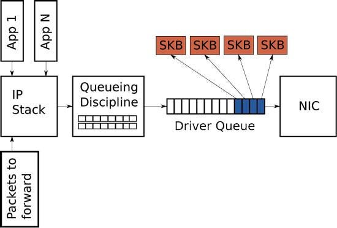
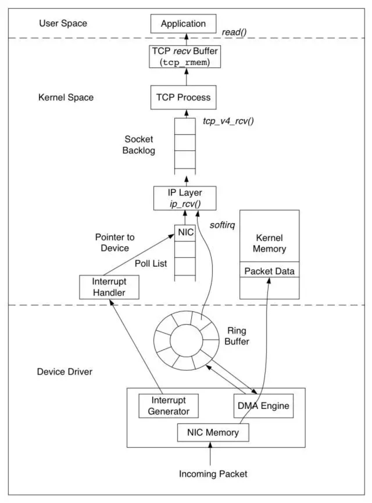
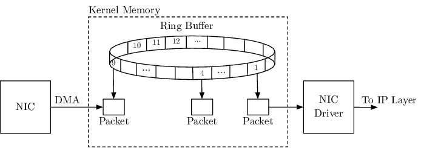

SKB (socket buffer)

is a data structure that represents a network packet. It is used by the Linux kernel to store and manage network packets. SKBs are allocated by the kernel when a packet is received or transmitted, and they are freed when the packet is no longer needed.

An SKB consists of two parts:

A header: The header contains information about the packet, such as its length, type, and destination address.
A payload: The payload contains the actual data of the packet.
The header and payload of an SKB are both allocated from the kernel’s memory pool. The header is always a fixed size, but the payload can be any size.

SKBs are used by all layers of the Linux networking stack. The network driver uses SKBs to receive and transmit packets, the network protocol layers use SKBs to store and process packets, and the upper-layer applications use SKBs to access the data of network packets.

https://medium.com/@ramkishan56/skb-socket-buffer-dd0b82d5eb3d

