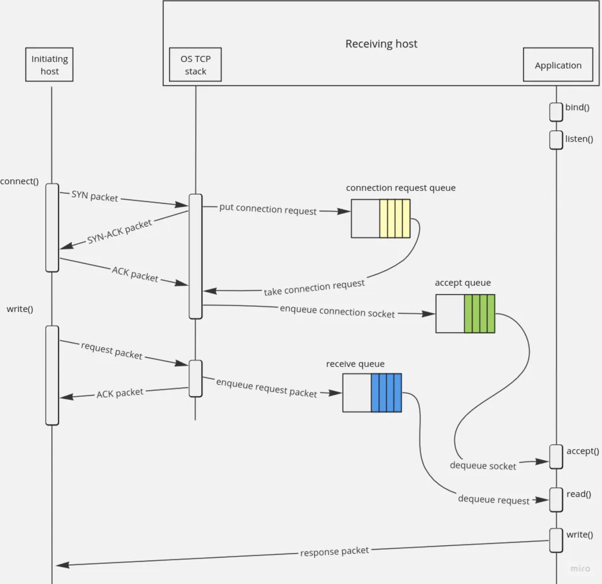

Hussein Nasser's Video

https://youtu.be/gSQoA4SYhJY

DMA = kernel reads packets directly from the memory (CPU not involved)

three way handshake in deep

then accept the conx (accept() in socket API)

int fd = accept(int sockfd, struct sockaddr *addr, socklen_t *addrlen);

now we have a new socket fd that we can use to send and recive data

conx established

the size of the accept queue is defined by the user - by the backlog parameter in listen() - 

u get two additional queues in the kernel per connection: receive queue and send queue

recv : bytes from the client are copied from the NIC to the receive queue
send : bytes from the send queue are copied from the send queue to the NIC 

Connection establishment
The process of connection creation in TCP is called the three-way handshake. It has three stages. First, a client sends a SYN packet. Server receives it and creates a data structure typically referred to as a connection request, or mini socket. It has an information that the future connection socket will need, so it has to store it until a connection is fully established. After this, a server sends a confirmation that a syn packet was processed. It’s sent in a syn-ack packet. When a client receives it, it finally sends the last packet, an ack. Server Linux kernel then creates a connected socket waiting for a server application to obtain, or accept, it.

[article](https://levelup.gitconnected.com/deep-dive-into-tcp-connection-establishment-process-f6cfb7b4e8e1)

When a syn packet arrives, server-side Linux kernel creates a connection request and saves it in a way historically referred to as a queue; you can stumble upon it elsewhere by the names of “half-open connection queue”, an “incomplete connection queue”, a “SYN queue”

[article](https://levelup.gitconnected.com/deep-dive-into-tcp-connection-establishment-process-f6cfb7b4e8e1)

